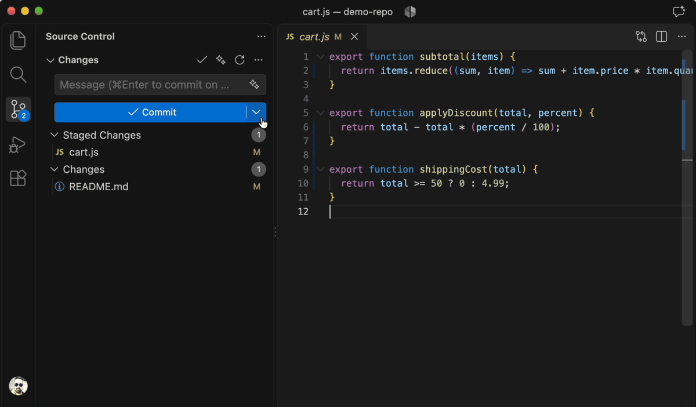
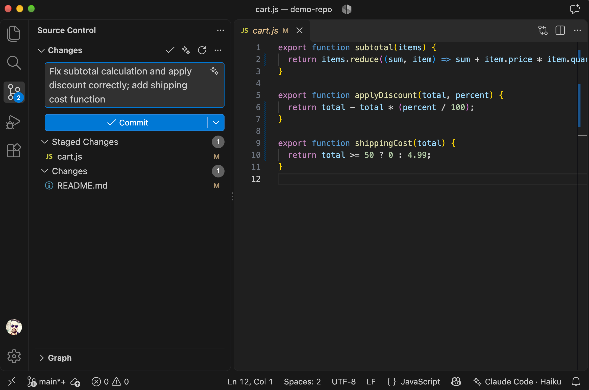
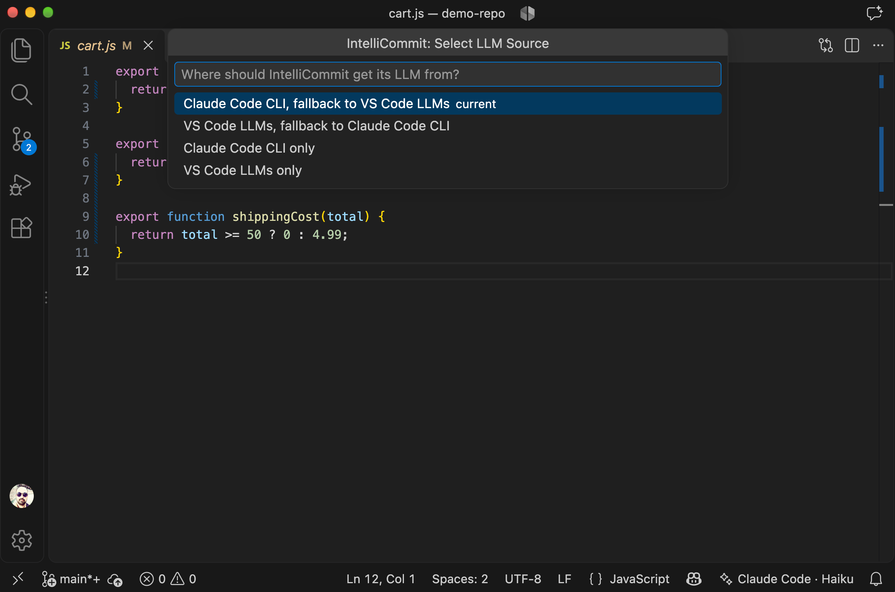
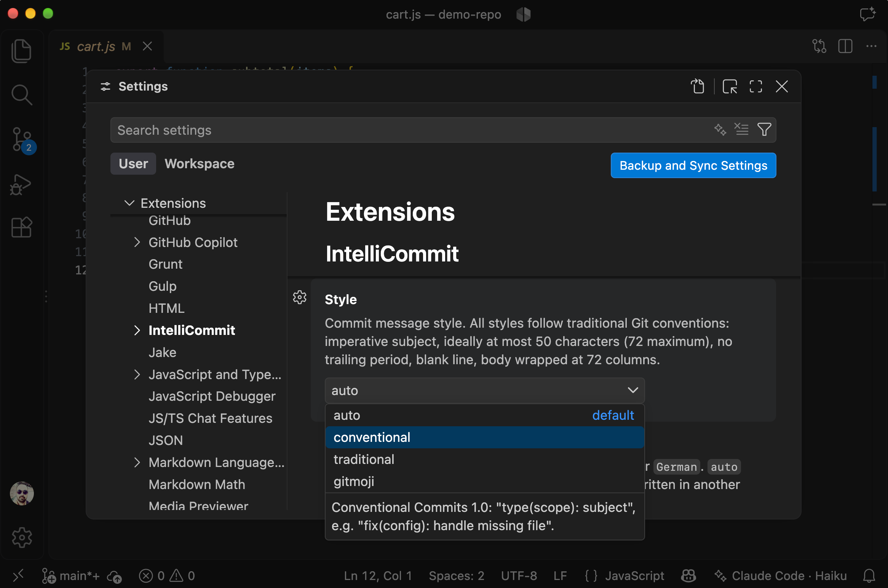

# IntelliCommit

IntelliCommit is a Visual Studio Code extension that writes Git commit messages for you. Click ✨ in the Source Control view, and a clear, well-formatted message describing your changes appears in the commit box.

No extra subscription needed: IntelliCommit works with your existing Claude plan through Claude Code, or with any AI model that another VS Code extension makes available.

## Features

- **One click or one shortcut.** Click ✨, or press **⌥↩** (**Alt+Enter** on Windows and Linux) in the commit box, and the message lands right there. With several repositories open, it goes to the right one.
- **Staged or not.** If you've staged something, the message covers exactly that. If not, it covers everything you changed, new files included. IntelliCommit never stages anything for you.
- **Proper commit messages.** A short summary line, a blank line, and a description when it's worth one, the way Git expects (see [Commit message format](#commit-message-format)). It can follow the style of your recent commits, Conventional Commits, or gitmoji.
- **Uses the AI you already have.** Your Claude plan through Claude Code, or a model from another VS Code extension. If one isn't there, IntelliCommit uses the other.
- **Quick and cheap by default.** It picks small, fast models unless you tell it otherwise.
- **Copes with big changes.** Lock files and generated files are skipped, and huge diffs are trimmed to fit what the model can read.

## Requirements

- VS Code 1.91 or newer, with the built-in Git extension enabled.
- At least one of the following:
  - **Claude Code.** [Install Claude Code](https://code.claude.com/docs/en/setup), then run `claude` once in a terminal to sign in. Requests count toward your Claude plan; no API key is needed.
  - **A VS Code extension that provides AI models.** The first time IntelliCommit uses one of its models, VS Code asks for your permission.

> **Billing note:** if the `ANTHROPIC_API_KEY` environment variable is set when VS Code starts, Claude Code uses that key instead of your Claude plan, and requests are billed to that API account. IntelliCommit records which one was used in **Output › IntelliCommit**.

## Getting started

1. Make some changes in a Git repository.
2. Open the Source Control view and click **✨** (Generate commit message) at the top. You can also press **⌥↩** (**Alt+Enter** on Windows and Linux) while the commit box has focus, or run **IntelliCommit: Generate commit message** from the Command Palette.
3. Review the message, edit it if you like, and commit.

While the message is being written, the ✨ button becomes a **Stop** button. If you stop it, or if something goes wrong, the commit box returns to what it contained before. If you start typing in the commit box while the message is being written, IntelliCommit stops and keeps your text. If the language model stops responding for 60 seconds, the request is cancelled.

If the commit box already has text, IntelliCommit replaces it by default. You can change this to add the new message below it, or to ask each time.

## Choosing the AI model

To choose where the model comes from, open the **…** menu at the top of the Source Control view and pick **Select LLM Source**, or run **IntelliCommit: Select LLM Source** from the Command Palette:

| Option | What it does |
|---|---|
| Claude Code CLI, fallback to VS Code LLMs (default) | Uses Claude Code. If it isn't installed, uses a VS Code model. |
| VS Code LLMs, fallback to Claude Code CLI | Uses a VS Code model. If none is available, uses Claude Code. |
| Claude Code CLI only | Uses only Claude Code. |
| VS Code LLMs only | Uses only VS Code models. |

The backup option is used only when the first choice isn't installed or available, not when a request fails.

**Claude Code models.** Haiku is the default. You can also choose Sonnet, Opus, or Fable (listed from least to most expensive). Each option always uses the newest model in that family.

**VS Code models.** By default, IntelliCommit picks automatically: first a model from your preferred list (see `intellicommit.preferredModels`), otherwise the least expensive model it finds. To use a specific model, enter its ID in `intellicommit.model`. The list of available model IDs is printed in **Output › IntelliCommit**.

Each request through Claude Code takes a few seconds, because Claude Code starts fresh every time. It runs in an empty temporary folder with access to tools, project files, and your Claude Code settings turned off, so it only sees the information IntelliCommit sends.

## Settings

| Setting | Default | Description |
|---|---|---|
| `intellicommit.source` | Claude Code CLI, fallback to VS Code LLMs | Where the AI model comes from (see above). |
| `intellicommit.claudeCode.model` | `haiku` | Claude model: `haiku`, `sonnet`, `opus`, or `fable`. |
| `intellicommit.claudeCode.path` | empty | Location of the `claude` program, if IntelliCommit can't find it on its own. |
| `intellicommit.model` | empty | ID of the VS Code model to use. Empty means automatic. |
| `intellicommit.preferredModels` | a list of small models | Model names to try first, in order. Avoid very short names like `mini`, which can match the middle of unrelated model names. |
| `intellicommit.style` | `auto` | Message style: `auto` (matches your recent commits), `conventional` ([Conventional Commits](https://www.conventionalcommits.org/)), `traditional`, or `gitmoji`. |
| `intellicommit.language` | `auto` | Message language. `auto` uses English unless your recent commits are in another language. |
| `intellicommit.customInstructions` | empty | Your own extra instructions for the AI (up to 2,000 characters). |
| `intellicommit.excludeGlobs` | lock files, generated files | Files whose contents are never sent. Their names are still listed. |
| `intellicommit.maxDiffChars` | `20000` | Maximum amount of change text sent, in characters (up to 100,000). |
| `intellicommit.onExistingText` | `replace` | What to do when the commit box already has text: `replace`, `append`, or `ask`. |

Style, language, instructions, excluded files, size limit, and existing-text behavior can be set separately for each project.

## Commit message format

IntelliCommit asks the AI to follow these rules, and corrects the result where needed:

- Start with a short summary line written as a command ("Add", "Fix", "Remove" — not "Added" or "Fixes").
- Keep the summary to about 50 characters, and no more than 72. A longer summary is kept as is rather than cut off mid-sentence.
- Start with a capital letter, with no period at the end of the summary.
- Add an optional longer description after a blank line, explaining what changed and why. Each paragraph or list item is a single line, so it fits any window width without stray line breaks. Small changes get a summary line only.
- Use plain text, without formatting symbols, quotes, or emoji (except in the `gitmoji` style).

The `conventional` style uses the `type(scope): description` format, for example `fix(parser): handle empty input`.

## Privacy

IntelliCommit sends the following to the AI service you selected (Anthropic for Claude Code, or the provider behind your VS Code model):

- your changes: the staged changes, or, if nothing is staged, all changes including the contents of new files
- the names of changed files (up to 200)
- the summary lines of your last 10 commits

Some files are listed by name only, and their contents are never sent:

- files matching `intellicommit.excludeGlobs`
- binary files, and new files larger than 200 KB
- files that typically hold passwords or keys, such as `.env`, `*.pem`, `*.key`, SSH keys, `.npmrc`, and cloud credential files

Secrets written inside ordinary files (for example, a token in a source file) are sent like any other change, so review your changes before generating a message. IntelliCommit does not collect any usage data.

## Keyboard shortcut

Press **⌥↩** (**Alt+Enter** on Windows and Linux) while the commit box has focus to generate a message without reaching for the mouse. To change the shortcut, search for `intellicommit.generate` in **Preferences: Open Keyboard Shortcuts**.

VS Code doesn't yet let published extensions place a button inside the commit box ([microsoft/vscode#195474](https://github.com/microsoft/vscode/issues/195474)), so the ✨ button sits at the top of the Source Control view.

## Known limitations

- If another installed extension also adds a ✨ button to Source Control, you may see two of them with the same hint. To be sure you're using IntelliCommit, press **⌥↩** (**Alt+Enter** on Windows and Linux) in the commit box or run **IntelliCommit: Generate commit message** from the Command Palette.
- If the `git.untrackedChanges` setting is `hidden`, new files can't be included in the message.
- IntelliCommit doesn't work in Restricted Mode, because VS Code turns off its Git support there.
- VS Code models are unavailable when AI features are turned off with the `chat.disableAIFeatures` setting.

## Contributing

Bug reports, ideas, and pull requests are welcome. Please [open an issue](https://github.com/manomintis/intellicommit/issues) to report a problem or discuss a larger change. See [CONTRIBUTING.md](CONTRIBUTING.md) for how to set up the project, run the tests, and submit changes.

## License

IntelliCommit is released under the [MIT License](LICENSE).

The icon is based on the "sparkle" icon from [VS Code Codicons](https://github.com/microsoft/vscode-codicons), licensed under [CC BY 4.0](https://creativecommons.org/licenses/by/4.0/).

IntelliCommit is not affiliated with or endorsed by Microsoft or Anthropic. Claude and Claude Code are trademarks of Anthropic, PBC.
